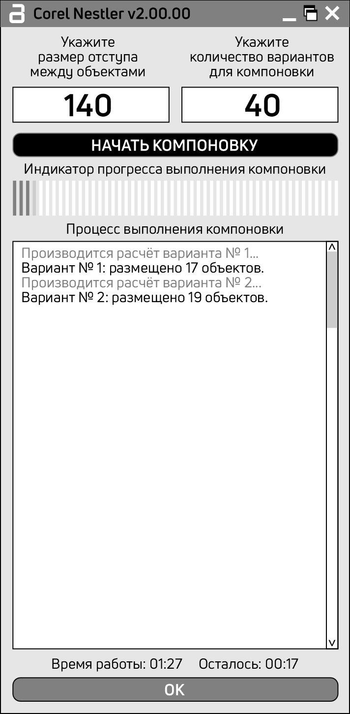

# Corel Nestler

## 📌 Описание программы
**Corel Nestler** — это профессиональный высокоскоростной плагин (написан на чистом C++ с использованием Win32 API) для автоматической, математически точной укладки (нестинга) объектов в CorelDRAW. Разработан для максимизации плотности размещения деталей при плоттерной и широкоформатной печати, а также фрезеровке. Алгоритм самостоятельно рассчитывает оптимальное расположение сотен деталей, экономя часы ручной работы и минимизируя отходы материалов.

## 🚀 Функции и возможности
* **Новое математическое ядро "Coarse-to-Fine BLF" (v6.0.0):** Используется эталонный метод укладки True Bottom-Left-Fill. Убраны абсолютно все жесткие лимиты сканирования по габаритам страницы. Детали идеально входят в вогнутости друг друга. 
* **Микро-слайд 0.5 мм:** Для ускорения расчетов основной сканер "пробегает" поле с шагом 2 мм, а при нахождении свободного места активируется микро-сдвиг: фигура скользит влево и вниз с ювелирной точностью **0.5 миллиметра**, гарантируя полное прилегание контуров и отсутствие "дыр" (воздушных просветов).
* **Генетический алгоритм поиска:** Ядро программы использует эволюционную стратегию генерации последовательностей (скрещивание и мутация Топ-5 лучших проходов). Это позволяет находить максимальную плотность укладки всего за 40 попыток. Метод 1000 случайных переборов остался в прошлом.
* **Адаптивная матрица:** Если баннеры физически не помещаются в дефолтную страницу CorelDRAW, матрица программы автоматически расширяется на неограниченное расстояние.
* **Абсолютная независимость:** Программа скомпилирована в единый .exe файл со статической линковкой (/MT). Не требует установки .NET Framework, VCRedist или сторонних библиотек.

## 📖 Руководство пользователя
1. Откройте ваш документ в **CorelDRAW** и выделите векторные объекты, которые необходимо скомпоновать.
2. Запустите файл CorelNester.exe.
3. В открывшемся окне плагина укажите желаемый отступ и лимит генераций. За счет генетического алгоритма и "Coarse-to-Fine" математики для идеального результата достаточно **40-50 вариантов**. Больше не нужно указывать 1000 проходов.
4. Нажмите кнопку **"НАЧАТЬ КОМПОНОВКУ"**.
5. Дождитесь завершения расчетов. В любой момент времени вы можете прервать расчеты нажатием на кнопку Х в шапке программы.
6. Нажмите **"OK"** для закрытия программы. Наилучший вариант компоновки уже применен к вашим фигурам в CorelDRAW. 

## 📜 История версий (Краткая)
* **v6.0.0** — Тотальный рефакторинг математического ядра. Внедрен "Coarse-to-Fine BLF" (Быстрый сканер с локальным микро-слайдом до 0.5 мм). Удалены барьеры pageWidth для поддержки сверхбольших баннеров. Метод 1000 случайных генераций заменен на Генетическую Эволюцию.
* **v5.0.0** — Переход на физику "Drop-and-Slide".
* **v4.6.0** — Внедрен Генетический Алгоритм поиска.
* **v4.5.0** — Динамическое отображение лучшего результата и габаритов укладки в реальном времени.

*Полная история изменений доступна в файле [HISTORY.md](HISTORY.md)*

## 📄 Лицензия
Программное обеспечение предоставляется на правах «Как есть» (AS IS).  
**Автор:** Павел Шадрин (ООО "Азбука")